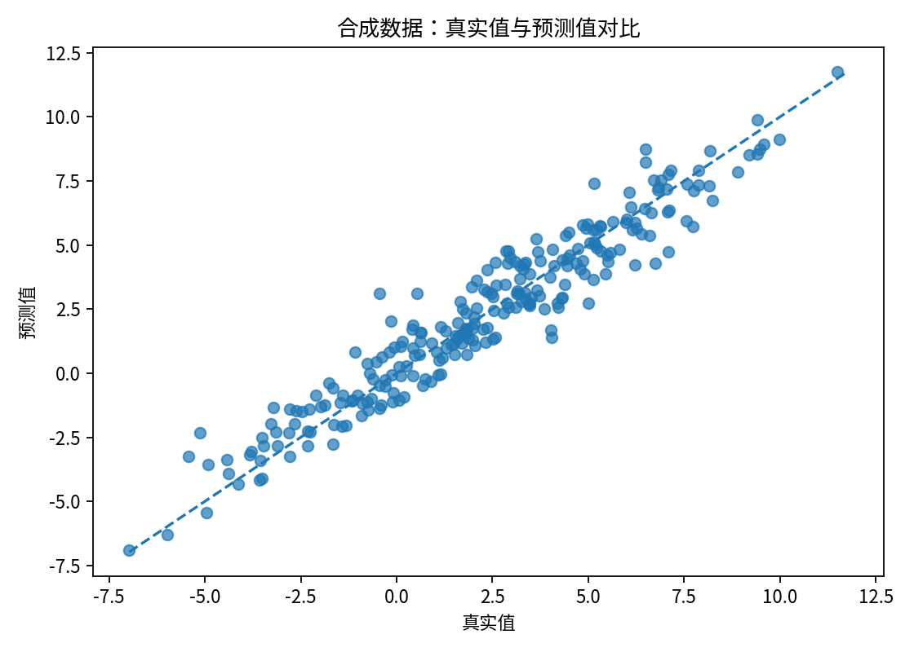
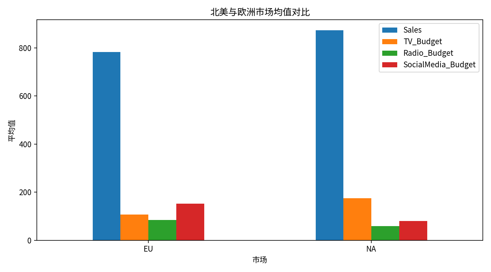
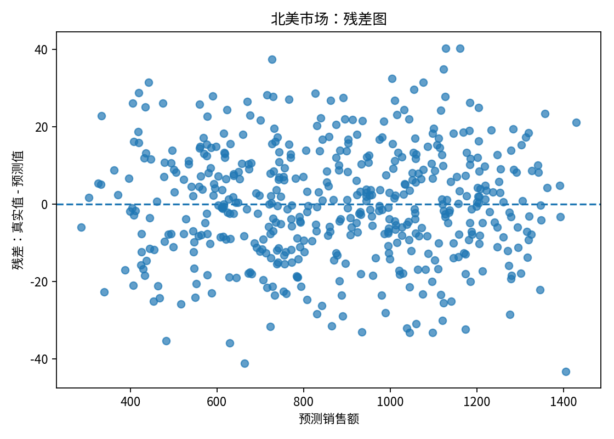
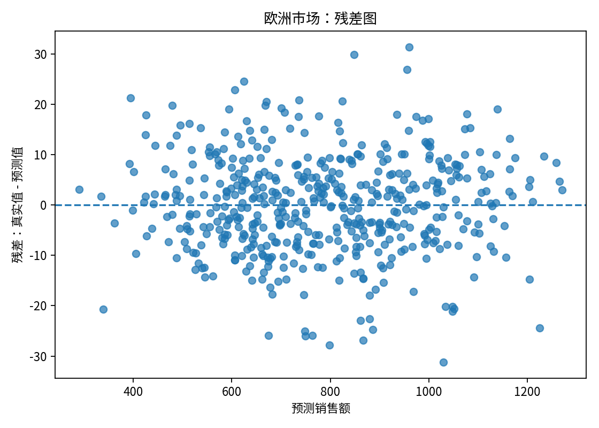

# 第 6 周回归分析作业报告

## 一、作业完成情况

本次作业采用 **Class Implementation**，即面向对象方式实现手写 OLS 推断引擎。核心类为 `CustomOLS`，支持：

- `fit(X, y)`：拟合模型，计算回归系数、残差方差和协方差矩阵。
- `predict(X)`：输出预测值。
- `score(X, y)`：计算 R²。
- `f_test(C, d)`：执行一般线性假设的 F 检验。

程序入口为：

```bash
uv run src/main.py
```

运行后会自动清空并重建 `students/07_nc/week06/` 文件夹。按照“写在一个 md 里”的要求，本程序只输出 **一个 Markdown 报告文件**：`week06_report.md`。图片也会自动保存在同一个 `results/` 文件夹中，并在本报告中说明。

## 二、为什么选择 Class 实现

我选择 Class 实现，而不是过程式函数。主要原因是：回归模型拟合后会产生很多状态，比如系数、协方差矩阵、残差方差、自由度等。如果用过程式写法，这些变量需要在多个函数之间不断传递，很容易传错。Class 写法可以把这些状态封装在模型实例内部。

在真实数据场景中，北美市场和欧洲市场需要分别建模。使用 Class 后，只需要创建：

```python
model_na = CustomOLS()
model_eu = CustomOLS()
```

两个模型各自保存自己的参数和检验结果，互不干扰。这正好体现了面向对象封装的优势。

## 三、统一接口与模型对比摘要

`evaluate_model()` 函数不关心传入对象到底是 `CustomOLS` 还是 `sklearn.linear_model.LinearRegression`，只要求对象具有 `.fit()`、`.predict()` 和 `.score()` 方法。这就是 Python 中的鸭子类型：不看类名，只看行为。

| 模型 | 训练耗时 | 测试集 R² | 测试集 MSE |
|---|---:|---:|---:|
| CustomOLS（手写 NumPy） | 0.006377 秒 | 0.9207 | 0.9773 |
| sklearn LinearRegression | 0.007337 秒 | 0.9207 | 0.9773 |

## 四、真实营销数据结论摘要

- 北美 NA: R²=0.9970, F=54450.3336, p=0
- 欧洲 EU: R²=0.9976, F=68786.6881, p=0

## 五、截距项处理说明

本作业中，我采用“显式添加截距列”的方式处理截距项。也就是说，在传入模型前，程序会向 X 的第一列加入全 1。因此 `CustomOLS` 不会在内部偷偷添加截距，这样更透明，也更符合课堂给出的矩阵公式。

为了让 sklearn 的结果可比，`LinearRegression` 使用 `fit_intercept=False`，避免 sklearn 再额外添加一次截距。

## 六、自动生成文件清单

运行后 `results/` 目录包含：

- `week06_report.md`：本文件，包含全部文字说明、模型结果、F 检验结论和业务解释。
- `synthetic_predicted_vs_actual.png`：合成数据预测效果图。
- `market_comparison.png`：北美和欧洲市场均值对比图。
- `na_residual_plot.png`：北美市场残差图。
- `eu_residual_plot.png`：欧洲市场残差图。

---

# 场景 A：合成数据白盒测试报告

## 1. 实验目的

本场景使用自己生成的合成数据来验证手写 `CustomOLS` 是否能正确完成普通最小二乘回归。因为真实参数由我们自己设定，所以这是一个“白盒测试”：如果模型写对了，估计系数应该接近真实系数，并且测试集拟合优度应该比较高。

## 2. 数据生成过程

本次生成了 1000 条样本，包含 3 个解释变量，并显式添加了一列全 1 作为截距项。真实参数设定为：

- β0: 真实值 2.000，估计值 2.035
- β1: 真实值 1.500，估计值 1.491
- β2: 真实值 -3.000，估计值 -3.032
- β3: 真实值 0.800，估计值 0.727

误差项服从均值为 0、标准差为 1 的正态分布。

## 3. 模型对比结果

| 模型 | 训练耗时 | 测试集 R² | 测试集 MSE |
|---|---:|---:|---:|
| CustomOLS（手写 NumPy） | 0.006377 秒 | 0.9207 | 0.9773 |
| sklearn LinearRegression | 0.007337 秒 | 0.9207 | 0.9773 |

## 4. 结论

手写 `CustomOLS` 与 `sklearn LinearRegression` 的 R² 非常接近，说明矩阵公式、预测函数和评分函数实现正确。由于本作业中的 `CustomOLS` 明确要求用户在 X 中加入截距列，所以为了公平比较，`sklearn` 模型使用了 `fit_intercept=False`，即同样使用 X 中已有的全 1 列作为截距。

生成图表：`synthetic_predicted_vs_actual.png`。图中点越接近 45 度虚线，说明预测越准确。
合成数据的真实值与预测值对比图：`synthetic_predicted_vs_actual.png`。图中点越接近 45 度虚线，说明预测越准确。


---

# 场景 B：真实营销数据分析报告

## 1. 数据读取与预处理

程序读取的数据文件为：

```text
/mnt/c/Users/14090/Regression-Analysis-2026/homework/week06/data/q3_marketing.csv
```

原始数据共有 1000 行。清洗步骤包括：去除列名空格、统一 `Region` 大小写、把预算和销售额列转换为数值型，并删除关键字段缺失的记录。清洗后保留 1000 行。

本次使用的解释变量包括：

- `TV_Budget`：电视广告预算
- `Radio_Budget`：广播广告预算
- `SocialMedia_Budget`：社交媒体广告预算
- `Is_Holiday`：是否节假日

因变量为：`Sales`。

截距项处理方式：在进入模型前，程序显式向 X 添加一列全 1。因此回归系数顺序为：`[截距, TV, Radio, SocialMedia, Holiday]`。

## 2. 分市场建模结果

| 市场 | 样本量 | R² | 平均销售额 | 平均广告预算合计 |
|---|---:|---:|---:|---:|
| 北美 NA | 500 | 0.9970 | 873.14 | 314.32 |
| 欧洲 EU | 500 | 0.9976 | 782.86 | 343.74 |

### 北美 NA 回归系数

| 变量 | 估计系数 |
|---|---:|
| 截距 | 48.1036 |
| TV 预算 | 3.5075 |
| Radio 预算 | 3.4977 |
| SocialMedia 预算 | 0.0021 |
| 节假日 | 26.6990 |

### 欧洲 EU 回归系数

| 变量 | 估计系数 |
|---|---:|
| 截距 | 28.8605 |
| TV 预算 | 1.5102 |
| Radio 预算 | 4.7987 |
| SocialMedia 预算 | 1.2028 |
| 节假日 | 18.2465 |

## 3. 联合 F 检验

检验假设为：

- 原假设 H0：TV、Radio、SocialMedia 三个广告渠道的系数同时为 0。
- 备择假设 H1：至少有一个广告渠道的系数不为 0。

换句话说，这个检验不是单独看某一个广告渠道，而是检验“广告投放策略整体是否有效”。

| 市场 | F 统计量 | p-value | 0.05 水平结论 |
|---|---:|---:|---|
| 北美 NA | 54450.3336 | 0 | 显著，拒绝原假设 |
| 欧洲 EU | 68786.6881 | 0 | 显著，拒绝原假设 |

北美 NA：F = 54450.3336，p-value = 0。在 0.05 显著性水平下，结论是：拒绝原假设。说明三个广告渠道作为一个整体，对销售额有显著解释力。

欧洲 EU：F = 68786.6881，p-value = 0。在 0.05 显著性水平下，结论是：拒绝原假设。说明三个广告渠道作为一个整体，对销售额有显著解释力。

## 4. 业务解释

从模型结果看，北美和欧洲应该分开建模，而不是混在一起用同一个模型。原因是两个市场的预算结构、平均销售额以及各渠道的边际效果都可能不同。使用两个独立的 `CustomOLS` 实例后，北美模型和欧洲模型的参数、残差方差、协方差矩阵和 F 检验结果都各自保存在自己的对象中，不会互相覆盖。

用大白话说：F 检验回答的是“电视、广播、社交媒体这三个广告渠道合在一起，到底有没有用”。如果 p-value 小于 0.05，就说明广告预算整体上确实能解释销售额变化；如果 p-value 不小于 0.05，就说明目前这批数据还不足以证明广告整体有效。

## 5. 图表说明

本程序自动生成了以下图表：

- `market_comparison.png`：北美与欧洲市场的平均销售额和平均预算对比。

- `na_residual_plot.png`：北美市场残差图，用来检查误差是否存在明显模式。

- `eu_residual_plot.png`：欧洲市场残差图，用来检查误差是否存在明显模式。

